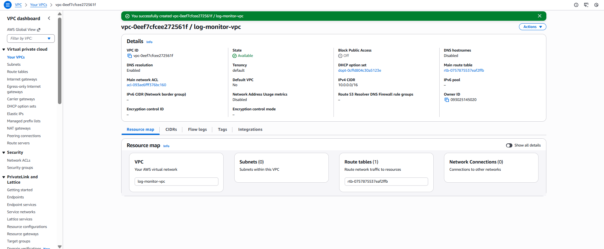
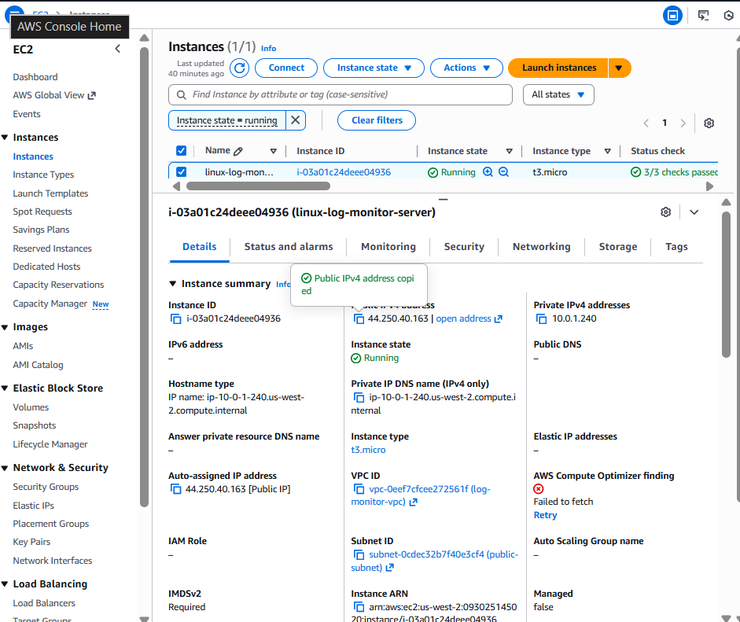
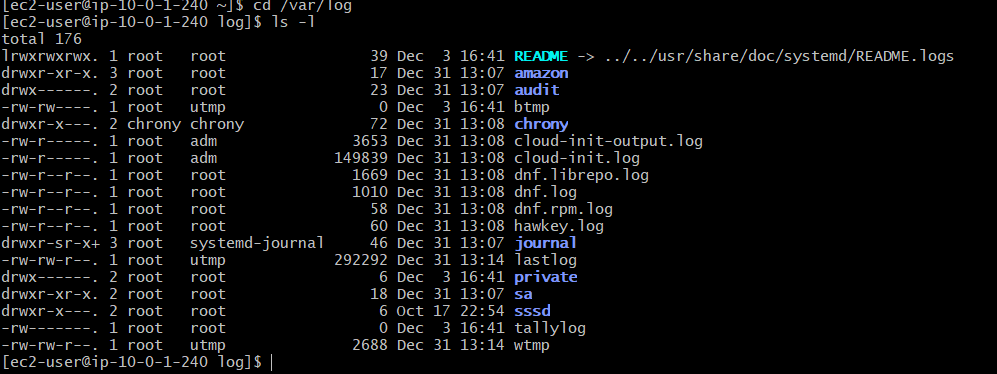
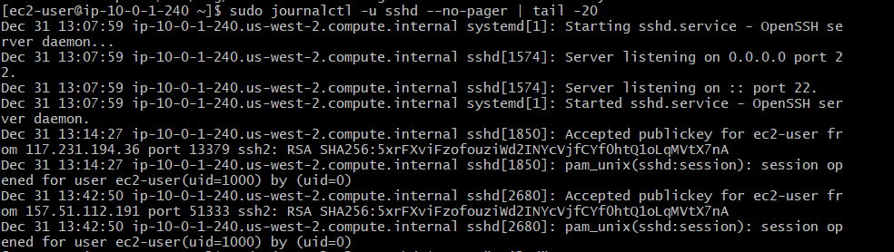
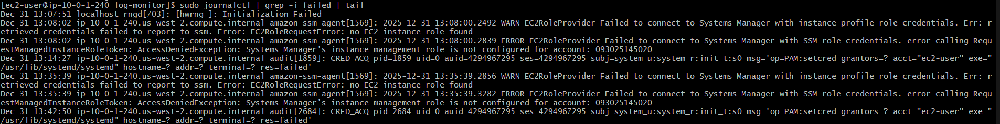
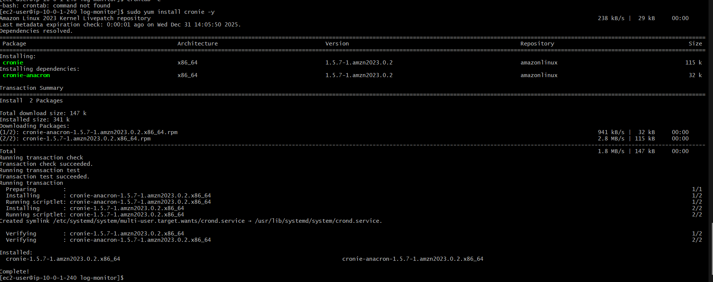
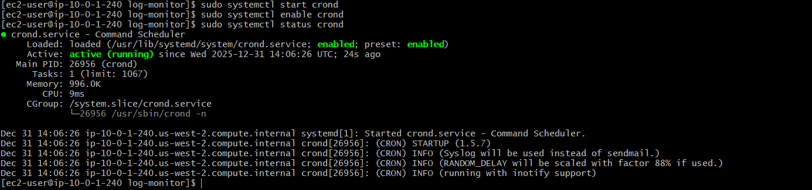
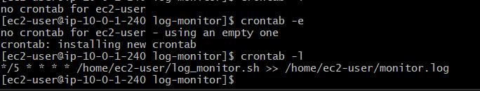

# Linux Log Monitoring & Alert System (AWS + Linux)

## 📌 Project Overview
This project implements a **Linux log monitoring and alert system** on an **Amazon Linux EC2 instance** deployed inside a **custom AWS VPC**.  
The system continuously monitors authentication logs to detect **failed SSH login attempts** and generates alerts using shell scripting and cron jobs.

---

## 🏗️ Architecture
- Custom AWS VPC
- Public Subnet with Internet Gateway
- EC2 (Amazon Linux)
- Security Group with restricted SSH access
- Linux system logs (`journalctl`, `auth events`)
- Shell scripting
- Cron scheduling

---

## 🛠️ Technologies Used
- AWS EC2
- AWS VPC
- Amazon Linux
- Bash / Shell Scripting
- Cron
- GitHub

---

## ⚙️ Implementation Steps

### 1. Custom VPC Setup
- Created a custom VPC with CIDR `10.0.0.0/16`
- Configured a public subnet
- Attached Internet Gateway
- Updated route table for internet access

---

### 2. EC2 Deployment
- Launched Amazon Linux EC2 inside the custom VPC
- Assigned public IP
- Attached security group allowing SSH access
- Used key-based authentication

---

### 3. Secure SSH Access
- Connected to EC2 using SSH key
- Verified system information and Linux environment

---

### 4. Log Analysis
- Identified authentication logs using `journalctl`
- Analyzed failed SSH login attempts
- Verified real-time log generation

---

### 5. Log Monitoring Script
A shell script was created to:
- Scan authentication logs
- Detect failed SSH login attempts
- Generate alert messages

📂 Script:
#!/bin/bash

LOGFILE="/home/ec2-user/monitor.log"
DATE=$(date)

FAILED_COUNT=$(sudo journalctl | grep -i "failed" | wc -l)

echo "[$DATE] Failed Login Attempts: $FAILED_COUNT" >> $LOGFILE

if [ $FAILED_COUNT -gt 5 ]; then
  echo "[$DATE] ALERT: Failed SSH Login Detected" >> $LOGFILE
fi
---

### 6. Cron Automation
- Installed cron package
- Scheduled the monitoring script using `crontab`
- Enabled automated log monitoring at regular intervals

 
 
 
---

## 🚨 Sample Alert Output

#Alert: Failed SSH Login Detected Failed Login Attempt Count: 7
---

## 🔐 Security Considerations
- SSH access restricted via Security Groups
- Key-based authentication used
- No sensitive credentials stored in repository

---

## 📌 Key Learnings
- Designing AWS infrastructure from scratch
- Linux log management and monitoring
- Automating tasks using cron
- Writing production-style shell scripts
- Documenting projects professionally

---

## 👩‍💻 Author
**Divya K**  
Data Analytics & Cloud Enthusiast  
SQL | Python | Power BI | AWS | Linux
